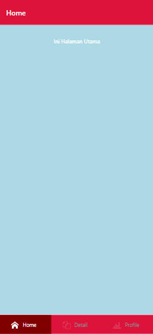
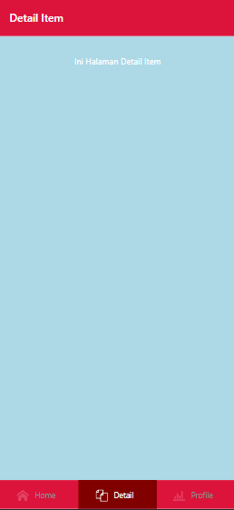
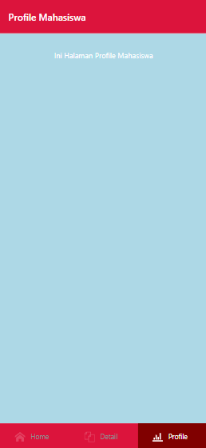

# UTS - PAM RA
## Merysah - 120140180

### Pages
- Home (Halaman Utama)

- Detail Item

- Profile Mahasiswa


### Daftar package yang digunakan (expo)
- expo-app-loading

### Cara menginstall aplikasi (dalam mode pengembangan)

1. install dependensi yang diperlukan
```sh 
npm install
```
atau
```sh 
yarn install
```
2. install expo
```sh 
npm i expo
```
3. build to apk (android)
```sh 
expo build:android
```
